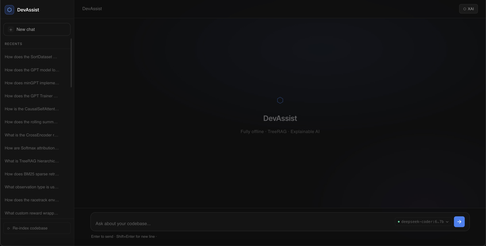
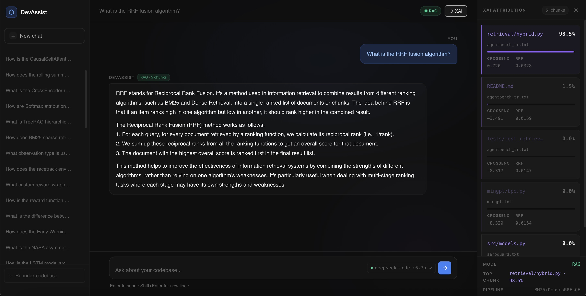
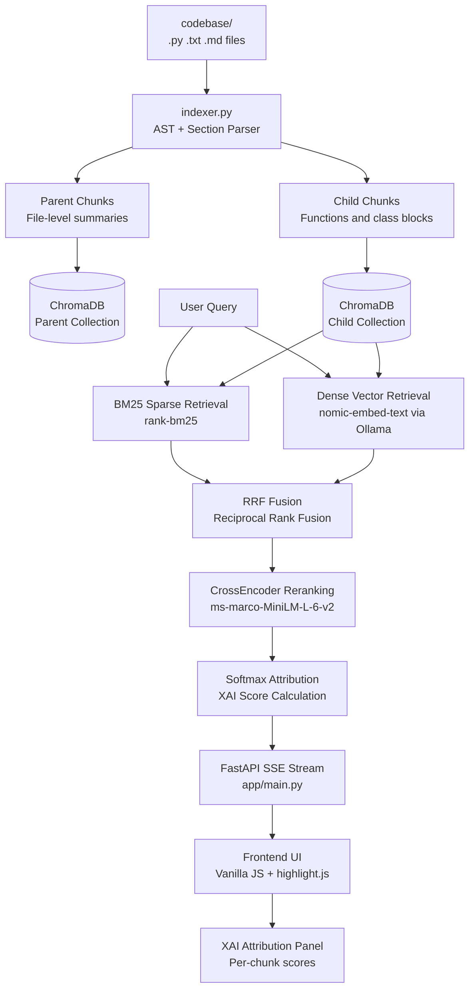
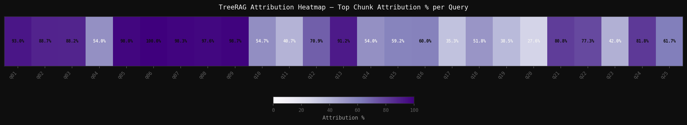
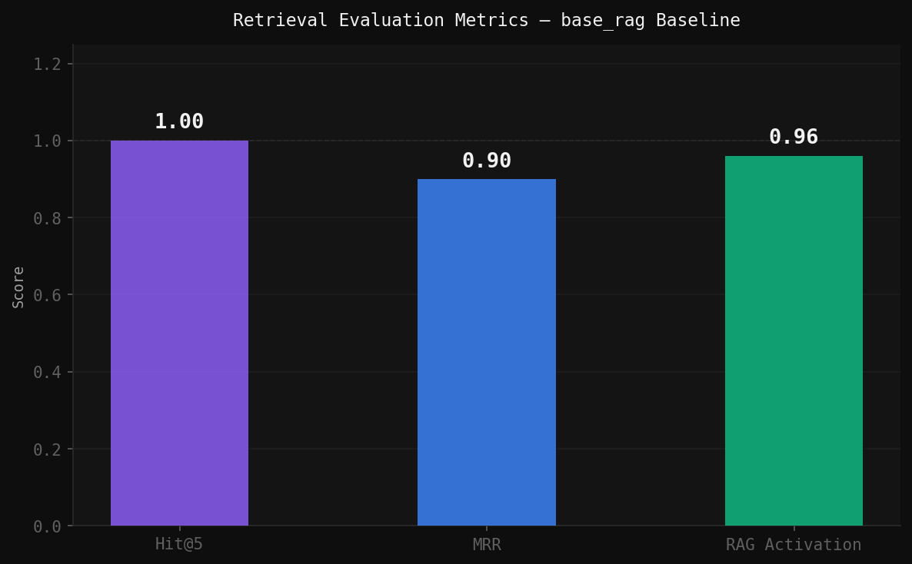
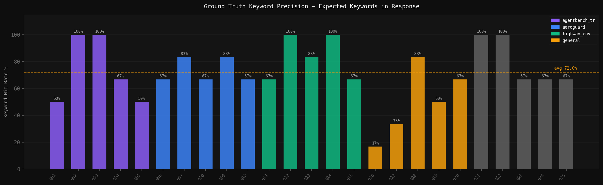
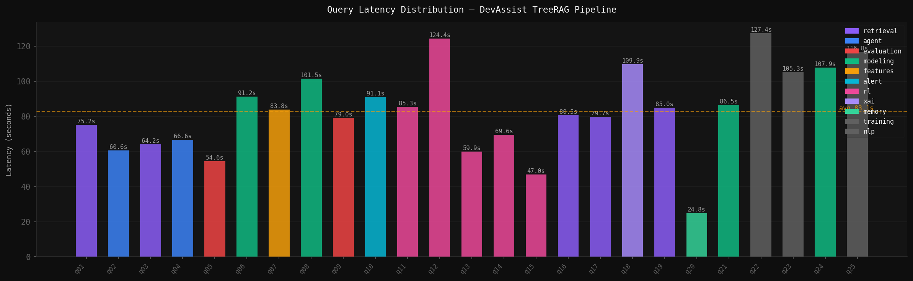
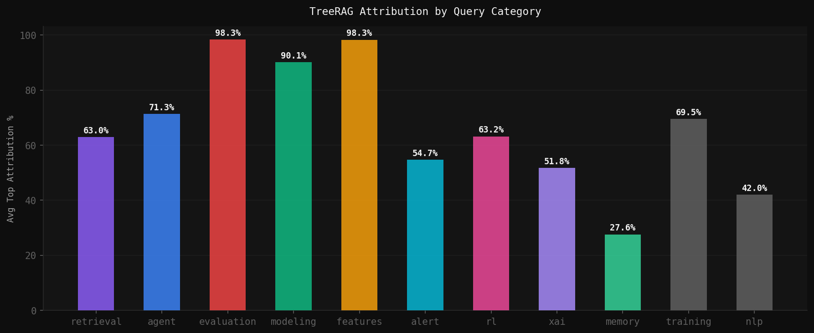

# DevAssist

[](https://github.com/burakkeynz/DevAssist/actions/workflows/lint.yml)


## What This Project Does

DevAssist is a fully offline AI code assistant built on Ollama, running deepseek-coder:6.7b for inference and nomic-embed-text for embeddings. No data leaves the machine at any point during runtime. The system works with the network adapter completely disabled.

The retrieval layer is built on TreeRAG; a hierarchical chunking approach where each file produces a parent chunk (file-level summary) and a set of child chunks (individual functions and classes extracted via AST parsing for Python, section-aware splitting for Markdown and Repomix text files). Queries retrieve child chunks, and parent context is available for escalation.

Hybrid retrieval combines BM25 keyword matching with dense vector search. The two result sets are fused using Reciprocal Rank Fusion, then reranked by a local CrossEncoder model. The final ranking feeds into Softmax normalization that converts raw scores into attribution percentages. These percentages appear in the XAI panel alongside every response, showing exactly which chunk contributed most to the answer and by how much.

The backend is a FastAPI server with Server-Sent Events streaming. The frontend is vanilla JavaScript with syntax highlighting via highlight.js, a chat history sidebar, and a sliding XAI attribution panel. Sessions, memories, and rolling summaries are persisted in SQLite.

## Why I Built This

Cloud assistants send every query and codebase snippet to remote servers. In environments where data confidentiality matters, where network access is restricted, or where you simply do not want your proprietary code leaving the machine, this is not acceptable. Every AI code assistant I used required a cloud connection and gave me answers with no explanation of where they came from.

I wanted something that runs entirely on my machine, understands my projects at a structural level, and tells me exactly which parts of the codebase it used to produce each answer; with a mathematical score attached to every retrieved chunk. DevAssist is that system.

## Screenshots





## System Architecture



## RAG Behavior

RAG mode activates when the top retrieved chunk exceeds the confidence threshold. The active mode is always visible in the UI via the RAG or General badge next to every response.

| Query Type                    | Mode    | Response                                                   |
| ----------------------------- | ------- | ---------------------------------------------------------- |
| Your specific indexed project | RAG     | Codebase context injected; deepseek answers from your code |
| Your tech stack (general)     | RAG     | Relevant chunks retrieved; answer grounded in indexed docs |
| General coding question       | General | deepseek built-in knowledge; no context injection          |
| Completely out of scope       | General | deepseek built-in only; quality depends on base model      |

## Indexed Codebase

DevAssist ships with four projects pre-indexed in ChromaDB. Any project can be added by dropping a file into `codebase/` and clicking the Re-index button.

**AgentBench-TR** is a multi-agent Turkish question-answering system built on LangGraph with a 4-agent pipeline (Planner, Search, Validator, Synthesizer), hybrid BM25 and vector retrieval with RRF, SQLite trace logging, and a Plotly Dash observability dashboard for consistency, hallucination rate, cost, and latency metrics.

**AeroGuard** is an end-to-end predictive maintenance pipeline on the NASA CMAPSS dataset. It covers sensor feature engineering with rolling window statistics, baseline model benchmarking, XGBoost with SHAP explainability, stacked LSTM training with Huber loss, and a three-tier early warning system mapping RUL predictions to Critical, Warning, and Normal alert levels.

**highway-env** covers reinforcement learning experiments across highway, roundabout, and racetrack environments; implementing DQN for discrete action spaces and SAC for continuous control, with custom reward wrappers and kinematics-based observation types.

**minGPT** is Andrej Karpathy's minimal PyTorch GPT re-implementation. It covers the full Transformer definition including causal self-attention, BPE tokenization, a GPT-independent training loop, and demo projects including a sort task and a character-level language model.

## Stack

| Component         | Technology                           |
| ----------------- | ------------------------------------ |
| Inference         | Ollama + deepseek-coder:6.7b         |
| Embeddings        | nomic-embed-text (local via Ollama)  |
| Vector Store      | ChromaDB                             |
| Keyword Retrieval | rank-bm25                            |
| Reranker          | cross-encoder/ms-marco-MiniLM-L-6-v2 |
| Backend           | FastAPI + SSE streaming              |
| Frontend          | Vanilla HTML/CSS/JS + highlight.js   |
| Database          | SQLite                               |

All inference components are local. The system continues operating if the network adapter is disabled after startup.

## Benchmark Results

Evaluated across 25 questions spanning all four indexed projects using the base_rag baseline.

| Metric              | Value   |
| ------------------- | ------- |
| Hit@5               | 1.0     |
| MRR                 | 0.9     |
| RAG Activation      | 24 / 25 |
| Avg Top Attribution | 69.7%   |
| Avg Latency         | 83.1s   |
| Total Questions     | 25      |

## Visualization Gallery

**TreeRAG Attribution Heatmap** shows top chunk attribution percentage per query across all 25 questions.



**Retrieval Evaluation Metrics** shows Hit@5, MRR, and RAG activation rate for the base_rag baseline.



**Ground Truth Keyword Precision** shows expected keyword hit rate per question, color-coded by project.



**Query Latency Distribution** shows per-question latency in seconds, color-coded by query category.



**Category Attribution Comparison** shows average top attribution percentage grouped by query category.



## XAI Attribution Engine

Every response includes a mathematical explanation of which codebase chunks contributed to the answer and by how much.

The retrieval pipeline runs as follows; the query is sent simultaneously to BM25 sparse retrieval and dense vector retrieval via nomic-embed-text. The two result sets are merged using Reciprocal Rank Fusion where each document's score is computed as the sum of 1 / (k + rank) across both lists. The fused ranking is passed to the CrossEncoder which scores each query-chunk pair jointly. Softmax normalization then converts those scores into attribution percentages that sum to 100%.

```
Query
  → BM25 (rank_bm25) + Dense (nomic-embed-text via Ollama)
  → Reciprocal Rank Fusion:  RRF(d) = Σ 1 / (k + rank(d))
  → CrossEncoder reranking   (ms-marco-MiniLM-L-6-v2)
  → Softmax attribution:     score_i = exp(s_i) / Σ exp(s_j)
  → Attribution percentage per chunk → XAI panel
```

```python
scores  = [cross_encoder_score for each top-k chunk]
exp_s   = exp(scores - max(scores))          # numerical stability
softmax = exp_s / sum(exp_s)                 # sums to 1.0
pct     = softmax * 100                      # attribution percentage
```

The XAI panel displays function name, file name, attribution percentage, CrossEncoder score, and RRF score for every retrieved chunk. The pipeline label at the bottom always reads `BM25+Dense→RRF→CE` confirming the full retrieval stack was used.

## Quick Start

**Requirements:** Python 3.9, [Ollama](https://ollama.com)

```bash
# Cloning repository...
git clone https://github.com/burakkeynz/DevAssist.git
cd DevAssist

# Creating and activating virtual environment...
python -m venv venv
source venv/bin/activate        # Windows: venv\Scripts\activate

# Installing dependencies...
pip install -r requirements.txt

# Pulling local models via Ollama...
ollama pull deepseek-coder:6.7b
ollama pull nomic-embed-text

# Creating custom Ollama model...
ollama create devassist -f Modelfile

# Starting inference engine and server...
export OLLAMA_KEEP_ALIVE=-1
export OLLAMA_FLASH_ATTENTION=1
ollama serve &
python -m app.main
```

Open `http://localhost:8000` in your browser, then click **Re-index codebase** to index the projects in `codebase/`.

**Adding your own projects:**

```bash
# Using repomix to pack a GitHub repo into a single file...
npx repomix --remote https://github.com/user/repo \
  --ignore "**/*.ipynb,**/data/**,**/*.jpg,**/*.png" \
  --output codebase/myproject.txt

# Re-indexing via API...
curl -X POST http://localhost:8000/index
```

## Example Usage

**Health check:**

```bash
curl http://localhost:8000/health
```

```json
{
  "status": "online",
  "model": "devassist",
  "embedding_model": "nomic-embed-text",
  "rag_store": "connected",
  "database": "connected"
}
```

**Query via terminal (with streaming):**

```bash
curl -X POST http://localhost:8000/query \
  -H "Content-Type: application/json" \
  -d '{"query": "How does the hybrid_retrieve function work?"}' \
  --no-buffer 2>/dev/null \
  | grep "data:" \
  | python3 -c "
import sys, json
for line in sys.stdin:
    line = line.strip()
    if not line.startswith('data:'):
        continue
    try:
        data = json.loads(line[5:])
        if data.get('type') == 'token':
            print(data.get('data', ''), end='', flush=True)
    except:
        pass
print()
"
```

**Index codebase:**

```bash
curl -X POST http://localhost:8000/index
```

```json
{
  "status": "success",
  "indexed_files": 7,
  "total_chunks": 112
}
```

**List sessions:**

```bash
curl http://localhost:8000/sessions
```

**Offline verification (network disabled):**

```bash
# Turn off Wi-Fi, then verify the system still responds...
curl http://localhost:8000/health
# {"status":"online","model":"devassist","rag_store":"connected"}
```

## Project Structure

```
devassist/
├── app/
│   ├── __init__.py
│   ├── indexer.py          # AST parser, TreeRAG chunking (.py .txt .md)
│   ├── rag.py              # BM25+Dense+RRF+CrossEncoder+Softmax XAI
│   ├── main.py             # FastAPI SSE streaming backend
│   └── database.py         # SQLite sessions, messages, memories
├── frontend/
│   ├── index.html          # Chat UI with XAI panel
│   ├── style.css           # Dark theme, Inter font
│   ├── app.js              # SSE streaming, attribution rendering
│   └── vendor/             # highlight.js, Inter font (fully offline)
├── eval/
│   ├── questions.json      # 25 evaluation questions with expected keywords
│   ├── run_benchmark.py    # Benchmark pipeline runner
│   ├── metrics.py          # Hit@5, MRR, RAG activation, keyword precision
│   └── visualize.py        # 5 benchmark visualization plots
├── results/
│   ├── plots/              # Generated benchmark visualizations
│   ├── benchmark_table.csv # Full benchmark results
│   └── screenshot_*.png    # UI screenshots
├── codebase/               # Indexed project files (.py .txt .md)
├── chroma_db/              # ChromaDB persistent store (auto-generated)
├── logs/                   # Query audit trail in JSONL format
├── fine_tuning/            # QLoRA pipeline scaffolding (not active)
├── .github/
│   └── workflows/
│       └── lint.yml        # flake8 CI on push and pull request
├── Modelfile               # Ollama devassist model configuration
├── requirements.txt
└── README.md
```

## Key Design Decisions

**Fully offline inference.** Every embedding and generation call goes through Ollama. No remote API is called at runtime. The CrossEncoder reranker runs locally via sentence-transformers. The system operates correctly with the network adapter disabled.

**TreeRAG over flat chunking.** Standard RAG splits files at fixed token boundaries, losing function boundaries and class structure. DevAssist uses AST parsing for Python to extract functions and classes as discrete child chunks, each linked to a parent file-level chunk. For Repomix-packed text files, section tags are used as split boundaries; for Markdown, headers define sections. This hierarchy means retrieval operates at the right granularity rather than catching arbitrary text windows.

**Hybrid retrieval with RRF.** BM25 matches exact keywords and variable names. Dense retrieval captures semantic similarity. Neither is sufficient alone; BM25 misses paraphrased descriptions and dense retrieval misses precise identifiers. Reciprocal Rank Fusion combines both ranked lists and rewards chunks that rank highly in both methods.

**CrossEncoder as second-stage reranker.** Bi-encoder similarity scores used for initial retrieval are fast but imprecise. The CrossEncoder reads the query and each candidate chunk together as a pair, producing a more accurate relevance score. Running it after RRF fusion keeps latency acceptable while improving final ranking quality.

**Softmax attribution for explainability.** Raw CrossEncoder scores are not directly comparable across queries. Softmax normalization converts them into a probability distribution summing to 100%, making attribution percentages meaningful and consistent. This is the number shown in the XAI panel for every chunk.

**SQLite for local persistence.** Chat history, session summaries, and saved memories are stored in a local SQLite database. A rolling summary mechanism compresses older context at a configurable message threshold, preventing context window overflow on long sessions without losing continuity.

## License

MIT License. Copyright (c) 2026 Burak Ege Kaya. Permission is hereby granted, free of charge, to any person obtaining a copy of this software and associated documentation files, to deal in the Software without restriction, including without limitation the rights to use, copy, modify, merge, publish, distribute, sublicense, and/or sell copies of the Software, subject to the following conditions: the above copyright notice and this permission notice shall be included in all copies or substantial portions of the Software.
